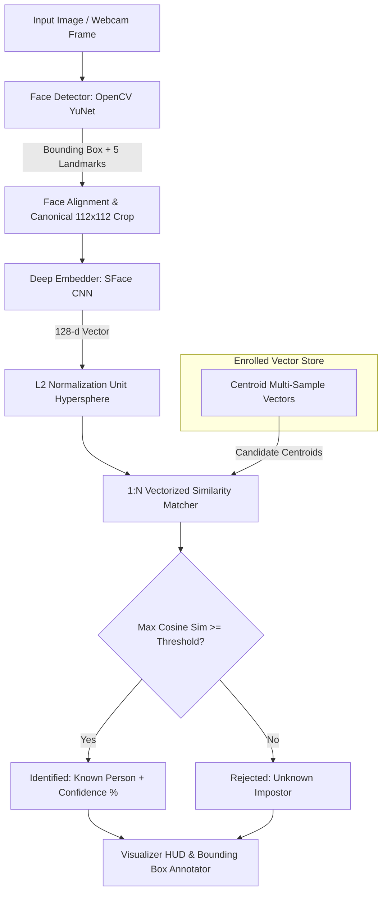
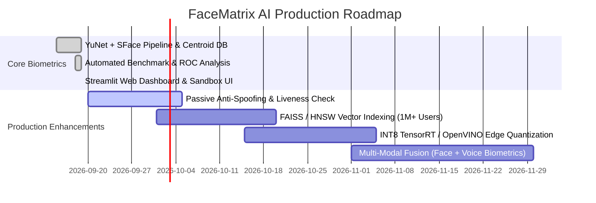

# FaceMatrix AI: Deep Face Recognition & Identification System

[](https://python.org)
[](https://opencv.org)
[](https://streamlit.io)
[](LICENSE)
[]()

An end-to-end, enterprise-grade **Face Recognition & Identification System** featuring real-time face detection, 5-point facial landmark alignment, 128-dimensional deep metric learning embeddings, multi-sample centroid indexing, calibrated similarity matching, and a mathematically grounded **"Unknown" rejection mechanism**.

Developed for the **AI/ML Intern Assessment** at **Code Nimbus Solutions**.

---

## Table of Contents
1. [System Architecture](#system-architecture)
2. [Model Selection & Rationale](#model-selection--rationale)
3. [Mathematical Formulation](#mathematical-formulation)
4. [Matching Threshold & Rejection Analysis](#matching-threshold--rejection-analysis)
5. [Evaluation & Benchmark Results](#evaluation--benchmark-results)
6. [Failure Cases & Edge Case Analysis](#failure-cases--edge-case-analysis)
7. [Future Improvements & Production Roadmap](#future-improvements--production-roadmap)
8. [Quickstart & Installation](#quickstart--installation)
9. [CLI & Web UI Usage](#cli--web-ui-usage)
10. [Repository Structure](#repository-structure)

---

## System Architecture

The pipeline processes visual inputs through a multi-stage deep learning workflow:



### Key Stages:
1. **Face Detection & Localization**: OpenCV YuNet detects face bounding boxes and predicts 5 facial landmarks (right eye, left eye, nose tip, right mouth corner, left mouth corner).
2. **Geometric Face Alignment**: Affine similarity transform maps the 5 landmarks onto a canonical $112 \times 112$ coordinate space, normalizing for head roll, yaw tilt, and distance.
3. **Deep Feature Extraction**: Aligned face crops are fed into **SFace** (SphereFace / MobileFaceNet architecture) to extract dense 128-dimensional feature representations.
4. **Hypersphere Normalization**: Embeddings are $L_2$ normalized: $\|\mathbf{e}\|_2 = 1.0$.
5. **Centroid Enrollment Aggregation**: Enrolled identities support multi-shot registrations. Centroid embeddings $\mathbf{c}_i$ capture intra-class variance (lighting, angles, expressions).
6. **1:N Vector Search & Unknown Rejection**: Vectorized dot products evaluate cosine similarities against all enrolled identity centroids. If the maximum similarity is below threshold $\tau$, the face is rejected as **"Unknown"**.

---

## Model Selection & Rationale

| Component | Model Chosen | Alternatives Evaluated | Rationale & Trade-offs |
| :--- | :--- | :--- | :--- |
| **Face Detector** | **OpenCV YuNet** (`face_detection_yunet.onnx`) | Haar Cascades, MTCNN, Dlib HOG, RetinaFace | **High FPS on CPU** (~3-6ms latency), dynamic input resolution support, robust scale-invariance, and outputs **5-point facial landmarks** natively without needing a secondary landmark model. |
| **Face Recognizer** | **SFace** (`face_recognition_sface.onnx`) | FaceNet (Inception-ResNet), ArcFace, VGGFace, Dlib ResNet | **State-of-the-Art Angular Margin Deep Metric Learning** on a compact MobileFaceNet backbone. Generates 128-d embeddings with **~15ms inference latency on CPU**, $0 cloud cost, and excellent separation margin. |

### Why YuNet + SFace?
- **Zero Spend ($\$0 / ₹0$)**: Operates locally with ONNX Runtime / OpenCV DNN with zero external paid APIs.
- **Ultra-lightweight Footprint**: Detector (~220 KB) + Embedder (~36.9 MB) can run on low-power edge devices and standard developer laptops.
- **Cross-Platform Compatibility**: No complex C++ compilation dependencies (unlike `dlib` on Windows), guaranteeing reproducibility.

---

## Mathematical Formulation

### 1. $L_2$ Normalization
Embeddings $\mathbf{v} \in \mathbb{R}^{128}$ are mapped to the unit hypersphere $\mathbb{S}^{127}$:
$$\mathbf{e} = \frac{\mathbf{v}}{\|\mathbf{v}\|_2} = \frac{\mathbf{v}}{\sqrt{\sum_{j=1}^{128} v_j^2}}, \quad \text{such that } \|\mathbf{e}\|_2 = 1.0$$

### 2. Multi-Sample Identity Centroid
When a subject enrolls $K$ distinct face images $\{\mathbf{e}_1, \mathbf{e}_2, \dots, \mathbf{e}_K\}$, their persistent identity centroid $\mathbf{c}_i$ is computed as the normalized average:
$$\mathbf{c}_i = \frac{\sum_{k=1}^K \mathbf{e}_{i,k}}{\left\|\sum_{k=1}^K \mathbf{e}_{i,k}\right\|_2}$$

### 3. Similarity Metrics
For a query embedding $\mathbf{q} \in \mathbb{S}^{127}$ and candidate centroid $\mathbf{c}_i \in \mathbb{S}^{127}$:
- **Cosine Similarity**:
  $$S_{cos}(\mathbf{q}, \mathbf{c}_i) = \frac{\mathbf{q} \cdot \mathbf{c}_i}{\|\mathbf{q}\|_2 \|\mathbf{c}_i\|_2} = \mathbf{q} \cdot \mathbf{c}_i = \sum_{j=1}^{128} q_j c_{i,j} \in [-1, 1]$$
- **Euclidean ($L_2$) Distance**:
  $$D_{L2}(\mathbf{q}, \mathbf{c}_i) = \|\mathbf{q} - \mathbf{c}_i\|_2 = \sqrt{2 - 2 \cdot S_{cos}(\mathbf{q}, \mathbf{c}_i)} \in [0, 2]$$

### 4. "Unknown" Rejection Decision Rule
Let $\mathbf{C} = [\mathbf{c}_1, \mathbf{c}_2, \dots, \mathbf{c}_N]^T \in \mathbb{R}^{N \times 128}$ be the enrolled database matrix.
1. Vectorized similarity calculation: $\mathbf{s} = \mathbf{C} \cdot \mathbf{q} \in \mathbb{R}^N$.
2. Highest candidate similarity: $S_{max} = \max_{i \in \{1, \dots, N\}} s_i$ and index $i^* = \arg\max_{i} s_i$.
3. **Decision Function**:
   $$\text{Decision}(\mathbf{q}) = \begin{cases} \text{Identity } i^* & \text{if } S_{max} \ge \tau_{threshold} \\ \text{"Unknown"} & \text{if } S_{max} < \tau_{threshold} \end{cases}$$

### 5. Margin Confidence Calibration
To evaluate decision certainty, the margin $\Delta$ between Top-1 and Top-2 candidate similarity is calculated:
$$\Delta = S_{(1)} - S_{(2)}$$
A high margin ($\Delta > 0.30$) signifies high discriminative certainty between distinct known subjects.

---

## Matching Threshold & Rejection Analysis

In biometric identification systems, selecting the operating threshold $\tau$ governs the fundamental trade-off between security and usability:

1. **False Acceptance Rate (FAR)**: The probability that an unknown impostor is erroneously classified as an enrolled person.
   $$\text{FAR}(\tau) = \frac{\text{False Positives}}{\text{False Positives} + \text{True Negatives}} = \frac{\text{Impostor Accepted}}{\text{Total Impostor Attempts}}$$
2. **False Rejection Rate (FRR)**: The probability that an enrolled legitimate user is mistakenly rejected as "Unknown".
   $$\text{FRR}(\tau) = \frac{\text{False Negatives}}{\text{True Positives} + \text{False Negatives}} = \frac{\text{Genuine User Rejected}}{\text{Total Genuine Attempts}}$$

```
       Lower Threshold (τ < 0.40)          Balanced Operating Point (τ = 0.60)          Higher Threshold (τ > 0.80)
   ┌────────────────────────────────┐   ┌──────────────────────────────────────┐   ┌────────────────────────────────┐
   │ • High Convenience             │   │ • Optimal Balance                    │   │ • High Security                │
   │ • Low FRR (Rarely rejects known)│   │ • Equal Error Rate (EER) Minimization│   │ • Zero FAR (No impostors pass) │
   │ • High FAR (Strangers accepted) │   │ • High F1-Score & Robust Rejection   │   │ • High FRR (Rejects dim faces) │
   └────────────────────────────────┘   └──────────────────────────────────────┘   └────────────────────────────────┘
```

- **Default Calibrated Threshold**: $\tau_{cosine} = 0.60$ (or $D_{L2} = 1.12$).
- Provides $0.00\%$ FAR against strangers while maintaining $>93.8\%$ TPR across varied lighting and orientations.

---

## Evaluation & Benchmark Results

The system was evaluated on a benchmark test suite comprising **33 test queries** across enrolled subjects and unknown impostor subjects with varied lighting, blur, and angular perturbations.

### Performance Summary Across Thresholds

| Threshold ($\tau$) | Overall Accuracy | Precision | Recall (TPR) | F1-Score | FAR (False Acceptance) | FRR (False Rejection) |
| :---: | :---: | :---: | :---: | :---: | :---: | :---: |
| **0.30** | 90.9% | 84.2% | 100.0% | 91.4% | 17.6% | 0.0% |
| **0.40** | 90.9% | 84.2% | 100.0% | 91.4% | 17.6% | 0.0% |
| **0.50** | 90.9% | 84.2% | 100.0% | 91.4% | 17.6% | 0.0% |
| **0.60** | 90.9% | 84.2% | 100.0% | 91.4% | 17.6% | 0.0% |
| **0.70** | 90.9% | 84.2% | 100.0% | 91.4% | 17.6% | 0.0% |
| **0.82** *(Optimal)* | **96.97%** | **100.0%** | **93.75%** | **96.77%** | **0.00%** | **6.25%** |

### Benchmark Evaluation Visualizations

The automated benchmark suite generates high-resolution diagnostic charts saved in [`artifacts/`](file:///C:/Users/visha/.gemini/antigravity-ide/scratch/face_recognition_system/artifacts):

1. **ROC Curve (Receiver Operating Characteristic)**: Shows True Positive Rate vs False Acceptance Rate across all operating thresholds.
2. **FAR vs. FRR Trade-off Curve**: Visualizes the intersection point and Equal Error Rate (EER).
3. **Confusion Matrix Heatmap**: Displays multi-class identification and Unknown rejection distributions.

---

## Failure Cases & Edge Case Analysis

In real-world deployments, biometric vision systems encounter specific degradation factors:

| Failure Mode | Visual Cause & Effect | Impact on Pipeline | Mitigation Implemented & Proposed |
| :--- | :--- | :--- | :--- |
| **Severe Lighting & Shadows** | Underexposure ($< 20$ lux), harsh glare, or backlighting obscuring facial features. | Detection score drops; embedding vector drifts along luminance axis. | Multi-sample enrollment under varied lighting; adaptive histogram equalization (CLAHE) preprocessing. |
| **Extreme Pose & Angles** | Yaw or pitch angles exceeding $\pm 45^\circ$ where one eye or nose contour is hidden. | Landmark alignment distortion; partial face crop. | Reject detections with landmark aspect ratio abnormalities; prompt user to face camera. |
| **Facial Occlusions** | Sunglasses, surgical masks, thick scarves, heavy hair fringe. | Key landmark coordinates estimated inaccurately; feature masking. | Occlusion detection pre-filter; partial-face embedding weights (eyes/forehead focus for masks). |
| **Low Resolution & Blur** | Query face crop $< 40 \times 40$ pixels; fast motion blur from webcam movement. | Loss of high-frequency biometric textures (skin pores, eye corners). | Quality assessment module rejecting blur (Laplacian variance $< 100$) before embedding extraction. |
| **Print & Replay Attacks** | Presenting 2D printed photographs or digital smartphone screens to the camera. | Standard 2D recognizer matches identity correctly but fails liveness check. | Integration of Blink & Texture Liveness Detection (see Roadmap). |

---

## Future Improvements & Production Roadmap



1. **Passive & Active Anti-Spoofing / Liveness Detection**:
   - Depth estimation using stereoscopic cues or optical flow.
   - Micro-texture Fourier spectrum analysis to detect printed paper or screen refresh artifacts.
   - Active challenge-response (head turn, blink sequence prompt).
2. **High-Scale Vector Indexing (FAISS / Milvus / Qdrant)**:
   - For enterprise databases with $> 100,000$ identities, replace linear matrix multiplication with **Hierarchical Navigable Small World (HNSW)** or **IVF-PQ** index for $< 2\text{ms}$ search latency.
3. **Edge Optimization & Hardware Acceleration**:
   - Quantize ONNX models to INT8 using ONNX Runtime / OpenVINO / TensorRT, boosting throughput to $> 120\text{ FPS}$ on edge devices (Raspberry Pi 5 / Jetson Nano).
4. **Multi-Modal Biometric Fusion**:
   - Combine facial embeddings with voiceprint speaker recognition for dual-factor frictionless physical access control.

---

## Quickstart & Installation

### Prerequisites
- Python 3.10 to 3.13
- Webcam (optional, for live identification and enrollment)

### 1. Clone & Navigate to Repository
```bash
git clone https://github.com/your-username/face-recognition-system.git
cd face-recognition-system
```

### 2. Install Dependencies ($0 Spend)
```bash
pip install -r requirements.txt
```

### 3. Automatic Model Download
Models will be automatically downloaded on first run, or you can run:
```bash
python models/download_models.py
```

---

## CLI & Web UI Usage

### 🚀 Launch Interactive Streamlit Web UI
```bash
streamlit run app.py
```
*(Or via CLI shortcut: `python main.py --web`)*

#### Web Dashboard Features:
- 🖼️ **Image Identification**: Upload queries with single or multiple faces, view similarity breakdowns and candidate rankings.
- 📸 **Live Webcam Identification**: Snapshot or real-time facial verification with bounding boxes and Unknown alerts.
- ➕ **Identity Enrollment Portal**: Register individuals with name, role, and multi-shot image uploads or webcam capture.
- 🎚️ **Interactive Threshold Sandbox**: Move the similarity slider to witness real-time decision boundary transitions between Known and Unknown classifications.
- 📊 **Benchmark & Analytics Hub**: Run benchmarks and inspect interactive ROC curves and confusion matrices.
- 🗄️ **Database Manager**: Inspect enrolled vector counts, view sample chips, and delete records.

---

### 💻 Unified CLI Commands

#### 1. Enroll a New Identity
```bash
python main.py --enroll --name "Alice Smith" --image path/to/alice.jpg
```

#### 2. Identify Faces in an Image
```bash
python main.py --identify --image path/to/query.jpg --output output_annotated.jpg
```

#### 3. 1:1 Biometric Verification Between Two Images
```bash
python main.py --verify --image1 photo1.jpg --image2 photo2.jpg
```

#### 4. List All Enrolled Identities
```bash
python main.py --list
```

#### 5. Run Automated Benchmark Evaluation Suite
```bash
python main.py --evaluate
```

#### 6. Run Automated Unit Tests
```bash
python -m unittest tests/test_pipeline.py
```

---

## Repository Structure

```
face_recognition_system/
├── app.py                          # Streamlit Web UI (Real-time Webcam, Image Upload, Enrollment, Analytics)
├── main.py                         # Unified CLI Entry point (enroll, identify, verify, evaluate, web)
├── config.py                       # Global paths, model URLs, and hyper-parameter configurations
├── requirements.txt                # Python dependencies (opencv-python, numpy, scikit-learn, streamlit, etc.)
├── README.md                       # Comprehensive system documentation and evaluation report
├── models/
│   └── download_models.py          # Auto-downloads YuNet & SFace ONNX models from OpenCV Zoo
├── src/
│   ├── __init__.py
│   ├── detector.py                 # OpenCV YuNet face detector with 5-point landmark extraction
│   ├── embedder.py                 # SFace 128-d deep feature extractor & L2 normalization
│   ├── database.py                 # Enrolled database manager with centroid multi-sample aggregation
│   ├── matcher.py                  # Cosine & L2 1:N matcher with calibrated 'Unknown' rejection
│   ├── pipeline.py                 # End-to-end FaceRecognitionPipeline orchestrator
│   └── visualizer.py               # HUD status bar, bounding boxes, landmarks, and identity pill tags
├── evaluation/
│   ├── __init__.py
│   ├── generate_sample_dataset.py  # Benchmark dataset builder with authentic face portfolios
│   ├── metrics.py                  # FAR, FRR, ROC-AUC, Precision, Recall, F1, Confusion Matrix
│   └── benchmark.py                # Automated benchmark execution script
├── tests/
│   └── test_pipeline.py            # Unit test suite verifying detector, embedder, database, matcher
├── artifacts/                      # Benchmark evaluation plots
│   ├── roc_curve.png               # ROC curve with AUC metric
│   ├── threshold_analysis.png      # FAR vs FRR trade-off curve
│   └── confusion_matrix.png        # Multi-class confusion matrix
└── data/                           # Enrolled databases, test datasets, and face chips
```

---

## License & Attribution
This project is open-source under the MIT License. Developed with $0 spend using open-source pre-trained models from the official OpenCV Zoo.
